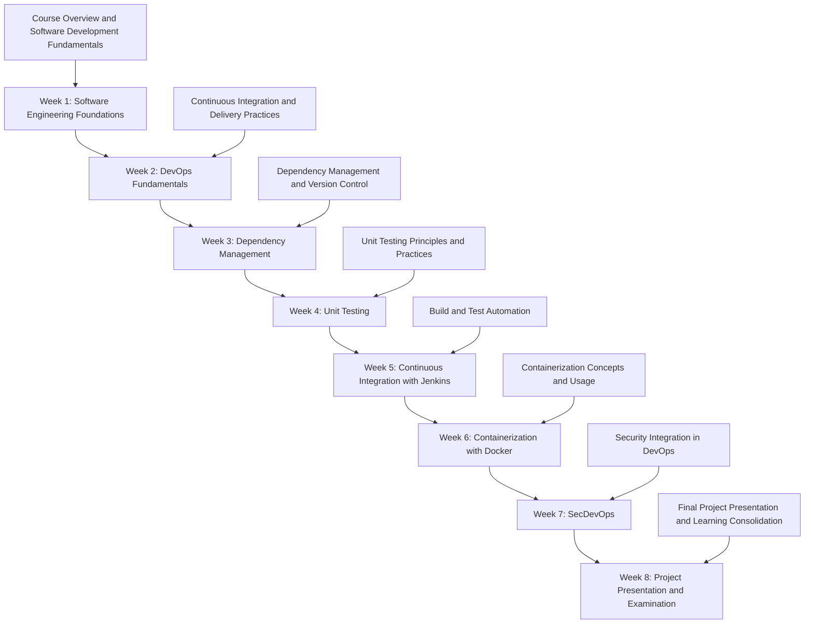

# Summary of the course

```mermaid
graph TD
    A[Week 1: Software Engineering Foundations] --> B[Week 2: DevOps Fundamentals]
    B --> C[Week 3: Dependency Management]
    C --> D[Week 4: Unit Testing]
    D --> E[Week 5: Continuous Integration with Jenkins]
    E --> F[Week 6: Containerization with Docker]
    F --> G[Week 7: SecDevOps]
    G --> H[Week 8: Project Presentation and Examination]

    A1[Course Overview and Software Development Fundamentals] --> A
    B1[Continuous Integration and Delivery Practices] --> B
    C1[Dependency Management and Version Control] --> C
    D1[Unit Testing Principles and Practices] --> D
    E1[Build and Test Automation] --> E
    F1[Containerization Concepts and Usage] --> F
    G1[Security Integration in DevOps] --> G
    H1[Final Project Presentation and Learning Consolidation] --> H

    click A1 href "https://github.com/ADirin/Sep1_Imp_2025/tree/main/Week1"
    click B1 href "https://github.com/ADirin/OTP1_LectureMaterial/tree/main/Week%202"
    click C1 href "https://github.com/ADirin/OTP1_LectureMaterial/tree/main/Week%203"
    click D1 href "https://github.com/ADirin/OTP1_LectureMaterial/tree/main/Week%204"
    click E1 href "https://github.com/ADirin/OTP1_LectureMaterial/tree/main/Week%205"
    click F1 href "https://github.com/ADirin/OTP1_LectureMaterial/tree/main/Week%206"
    click G1 href "https://github.com/ADirin/OTP1_LectureMaterial/tree/main/Week%207"
    click H1 href "https://github.com/ADirin/OTP1_LectureMaterial/tree/main/Week%208"


```
