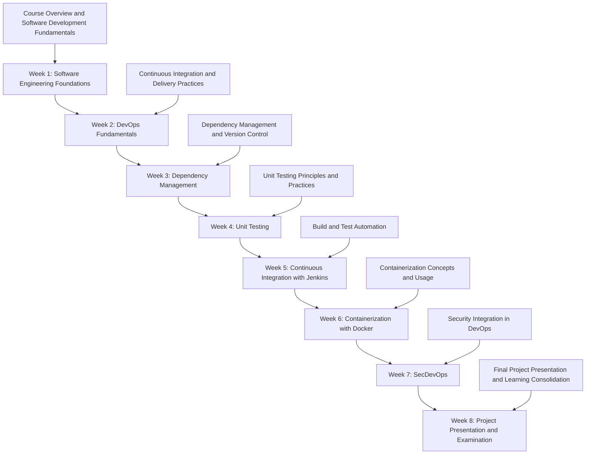
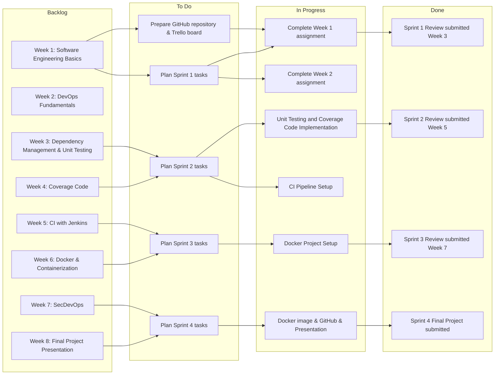

# Summary of the course

This course introduces students to foundational software engineering principles within a DevOps-oriented development workflow. Throughout the course, students apply Scrum practices, working in teams with defined roles and iterative development cycles. Each sprint includes sprint planning, in-class development assignments, and sprint review activities, enabling students to translate theory into practice.

The course covers dependency management, version control, automated testing, continuous integration, containerization, and secure DevOps practices. Learning is reinforced through hands-on in-class assignments and a team-based project, culminating in a final project presentation and evaluation. This structure ensures continuous feedback, iterative improvement, and alignment between technical skills, agile processes, and collaborative software development.

## The Sprints delivery

