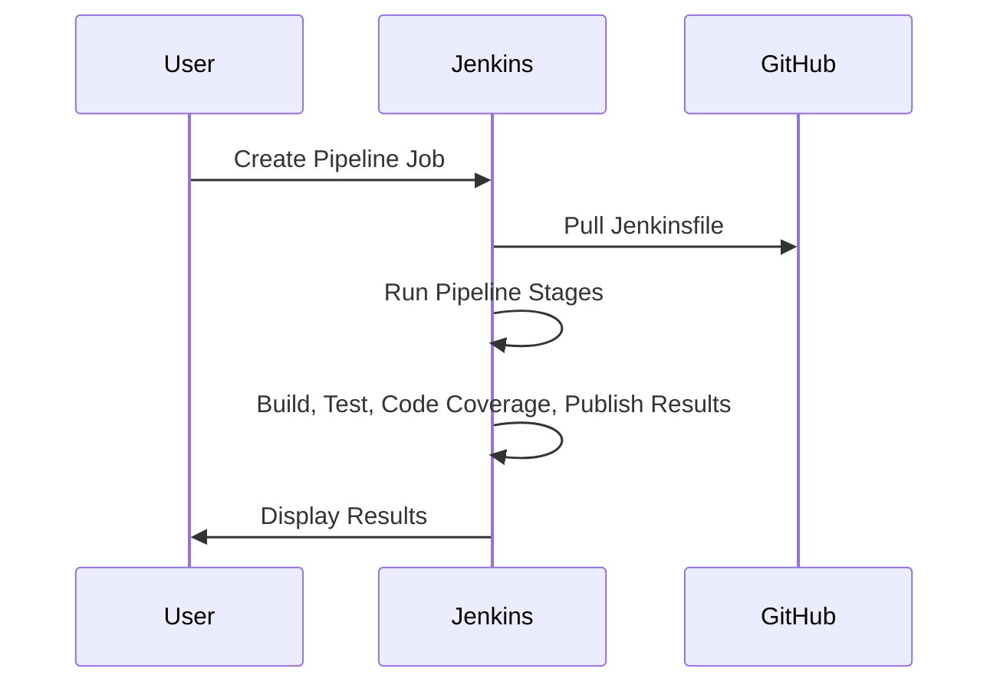
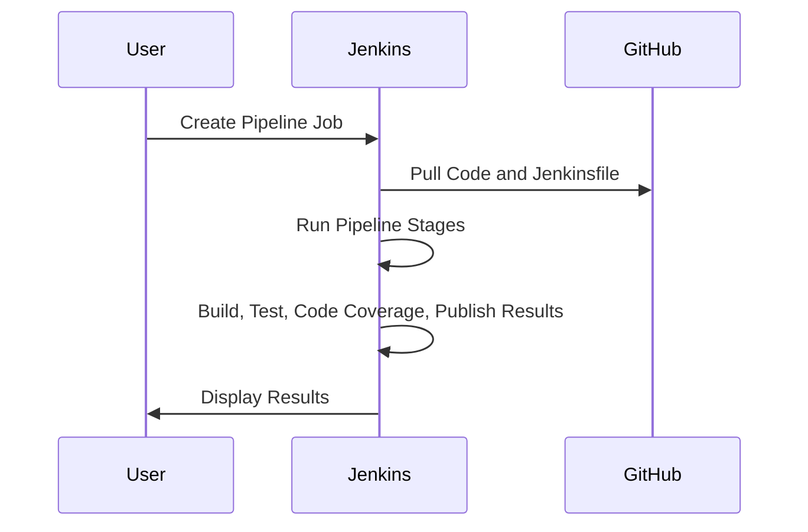

#  Using pipeline in Jenkins:

Jenkins Pipeline is a powerful tool for managing complex build and deployment workflows, making it an essential skill for students interested in DevOps and continuous integration/continuous delivery (CI/CD).

## Jenkins Pipeline
**Jenkins Pipeline** is a suite of plugins in Jenkins, an open-source automation server, that supports implementing and integrating continuous delivery pipelines. It allows you to define your entire build process, from code commit to deployment, as code. This is done using a domain-specific language (DSL) called Groovy.

### Key Features:
- **Declarative and Scripted Pipelines**: Two types of syntax to define your pipeline, making it flexible and easy to use.
- **Stages and Steps**: Break down your pipeline into stages (e.g., Build, Test, Deploy) and steps (individual tasks within stages).
- **Version Control Integration**: Easily integrate with Git, SVN, and other version control systems.
- **Extensibility**: Add plugins to extend Jenkins' functionality, such as integrating with various tools and platforms.

### Benefits:
- **Automation**: Automate repetitive tasks, reducing manual errors.
- **Consistency**: Ensure consistent build and deployment processes.
- **Visibility**: Gain insights into your pipeline's status and performance through visualizations and logs.


# Modify Pipeline to Use Declarative Syntax Correctly

Make sure your pipeline stages are clearly defined and contain actual steps. In your current script, you only have one stage, which might be too minimal to display a clear visual pipeline. You can add multiple stages and steps to see the pipeline stages more clearly.

## Options for Applying Pipelines in Jenkins

There are several ways to apply pipelines in Jenkins, each with its own advantages. Here are some common options:

### 1. Jenkinsfile in GitHub
- **Description**: Store your pipeline definition in a `Jenkinsfile` within your project's repository on GitHub.
- **Advantages**:
  - **Version Control**: Track changes to your pipeline alongside your code.
  - **Collaboration**: Easily share and review pipeline code with team members.
  - **Consistency**: Ensure the same pipeline is used across different Jenkins instances.

### 2. Pipeline Script Directly in Jenkins
- **Description**: Write and manage your pipeline script directly within the Jenkins user interface.
- **Advantages**:
  - **Quick Setup**: Easily create and modify pipelines without needing to push changes to a repository.
  - **Immediate Feedback**: Test and debug pipeline scripts directly in Jenkins.

### 3. Shared Libraries
- **Description**: Use shared libraries to define reusable pipeline code that can be used across multiple projects.
- **Advantages**:
  - **Reusability**: Share common pipeline code across different projects.
  - **Maintainability**: Centralize updates and maintenance of pipeline code.

### 4. Declarative vs. Scripted Pipelines
- **Declarative Pipelines**:
  - **Description**: Use a simplified, structured syntax to define your pipeline.
  - **Advantages**: Easier to read and write, with built-in error handling and validation.
- **Scripted Pipelines**:
  - **Description**: Use Groovy scripting for more complex and flexible pipeline definitions.
  - **Advantages**: Greater control and flexibility for advanced use cases.

### 5. Pipeline as Code with Multibranch Pipelines
- **Description**: Automatically create pipelines for each branch in your repository.
- **Advantages**:
  - **Branch-Specific Pipelines**: Customize pipelines for different branches.
  - **Automation**: Automatically detect and create pipelines for new branches.

Each method has its own use cases and benefits, so you can choose the one that best fits your project's needs.


## Example with Multiple Stages:
Sample pom.xml
```xml

   
    <properties>
        <maven.compiler.release>21</maven.compiler.release>
        <project.build.sourceEncoding>UTF-8</project.build.sourceEncoding>
    </properties>

    <dependencies>
        <dependency>
            <groupId>org.junit.jupiter</groupId>
            <artifactId>junit-jupiter</artifactId>
            <version>5.11.1</version>
            <scope>test</scope>
        </dependency>
        <dependency>
            <groupId>junit</groupId>
            <artifactId>junit</artifactId>
            <version>4.13.2</version>
            <scope>test</scope>
        </dependency>
    </dependencies>

    <build>
        <finalName>cal</finalName>
        <plugins>
            <!-- Maven Compiler Plugin -->
            <plugin>
                <groupId>org.apache.maven.plugins</groupId>
                <artifactId>maven-compiler-plugin</artifactId>
                <version>3.13.0</version>
                <configuration>
                    <release>23</release>
                    <compilerArgs>
                        <arg>--enable-preview</arg>
                    </compilerArgs>
                </configuration>
            </plugin>

            <!-- Maven Jar Plugin -->
            <plugin>
                <groupId>org.apache.maven.plugins</groupId>
                <artifactId>maven-jar-plugin</artifactId>
                <version>3.4.1</version>
                <configuration>
                    <archive>
                        <manifest>
                            <mainClass>Cal</mainClass>
                        </manifest>
                    </archive>
                </configuration>
            </plugin>

            <!-- JaCoCo Code Coverage Plugin -->
            <plugin>
                <groupId>org.jacoco</groupId>
                <artifactId>jacoco-maven-plugin</artifactId>
                <version>0.8.12</version>
                <executions>
                    <execution>
                        <goals>
                            <goal>prepare-agent</goal>
                        </goals>
                    </execution>
                    <execution>
                        <id>report</id>
                        <phase>prepare-package</phase>
                        <goals>
                            <goal>report</goal>
                        </goals>
                    </execution>
                </executions>
            </plugin>

            <!-- Surefire Plugin for Running Tests -->
            <plugin>
                <groupId>org.apache.maven.plugins</groupId>
                <artifactId>maven-surefire-plugin</artifactId>
                <version>3.5.1</version>
                <configuration>
                    <includes>
                        <include>**/*Test.java</include>
                    </includes>
                </configuration>
            </plugin>
        </plugins>
    </build>


```

```groovy
pipeline {
    agent any
    stages {
        stage('Compile') {
            steps {
                echo 'Compile stage completed'
            }
        }
        stage('Test') {
            steps {
                echo 'Test stage completed'
            }
        }
        stage('Deploy') {
            steps {
                echo 'Deploy stage completed'
            }
        }
    }
}
```


## 2. Using a Pipeline with a Jenkinsfile in GitHub

### Steps to Set Up a Jenkins Pipeline with a Jenkinsfile

1. **Create a Jenkinsfile in GitHub**
   - Add a `Jenkinsfile` to your GitHub repository with the following content:
   - **NOTE**: if you want to use the following pipeline in windows environment make sure
     1. replace sh to **bat** throughout the following script, for Linux or Mac OS the sh works fine
     2. You have to add the git-repo link in the git tag

    ```groovy
    pipeline {
        agent any
        stages {
            stage('Checkout') {
                steps {
                    git 'https://github.com/your-username/your-repo.git'
                }
            }
            stage('Build') {
                steps {
                    sh 'mvn clean install'
                }
            }
            stage('Test') {
                steps {
                    sh 'mvn test'
                }
            }
            stage('Code Coverage') {
                steps {
                    sh 'mvn jacoco:report'
                }
            }
            stage('Publish Test Results') {
                steps {
                    junit '**/target/surefire-reports/*.xml'
                }
            }
            stage('Publish Coverage Report') {
                steps {
                    jacoco()
                }
            }
        }
    }
    ```
# Steps to Ensure You See the Stages:

## 1. Ensure You're Using a Multibranch or Pipeline Job
Make sure your Jenkins job is of type **Pipeline** (or **Multibranch Pipeline**). The pipeline view works best with these types of jobs.

## 2. Make Sure You Have Jenkins Blue Ocean Installed (Optional)
**Blue Ocean** is a plugin that provides a better UI for Jenkins pipelines, making it easier to visualize stages.
If you don't have it installed:
1. Go to **Manage Jenkins > Manage Plugins**.
2. Search for **Blue Ocean** under the "Available" tab and install it.
3. Once installed, you can view your pipeline visually by clicking on the **Blue Ocean** option in the Jenkins dashboard.

## 3. Run the Pipeline Job
1. Click on **Build Now** for your pipeline job.
2. Go to **Build History > Console Output** to view the output.
3. If **Blue Ocean** is installed, you can also view the graphical representation of the pipeline by clicking on the **Blue Ocean** link.

## 4. Check the Stages Tab
Even without **Blue Ocean**, the regular Jenkins UI should show a **Stages** tab or **Pipeline Steps** in the pipeline build details, where you can see each of your pipeline stages and their status (e.g., Passed, Failed, etc.).
----------------------------------------------------------------------------------------------

2. **Create a Pipeline Job in Jenkins**
   - Go to Jenkins dashboard.
   - Click on "New Item".
   - Enter a job name.
   - Select "Pipeline" and click "OK".

3. **Configure the Pipeline**
   - Under the "Pipeline" section, set "Definition" to "Pipeline script from SCM".
   - Select "Git" as SCM and provide your GitHub repository URL.
   - In "Script Path", enter `Jenkinsfile`.

4. **Save and Run**
   - Save the job and click "Build Now" to run the pipeline.

### Sequence Diagram



---

## 3. Creating a Jenkins Pipeline in GitHUb

### Steps to Create a Declarative Pipeline

1. **Create a New Pipeline Job in Jenkins**
   - Go to Jenkins dashboard.
   - Click on "New Item".
   - Enter a job name.
   - Select "Pipeline" and click "OK".

2. **Configure the Pipeline**
   - Under the "Pipeline" section, choose "Pipeline script from SCM" and add the github repository URL (public)
   - Write the following script:

    ```groovy
    pipeline {
        agent any
        stages {
            stage('Checkout') {
                steps {
                    git 'https://github.com/your-username/your-repo.git'
                }
            }
            stage('Build') {
                steps {
                    sh 'mvn clean install'
                }
            }
            stage('Test') {
                steps {
                    sh 'mvn test'
                }
            }
            stage('Code Coverage') {
                steps {
                    sh 'mvn jacoco:report'
                }
            }
            stage('Publish Test Results') {
                steps {
                    junit '**/target/surefire-reports/*.xml'
                }
            }
            stage('Publish Coverage Report') {
                steps {
                    jacoco()
                }
            }
        }
    }
    ```

3. **Save and Run**
   - Save the job and click "Build Now" to run the pipeline.

### Sequence Diagram




