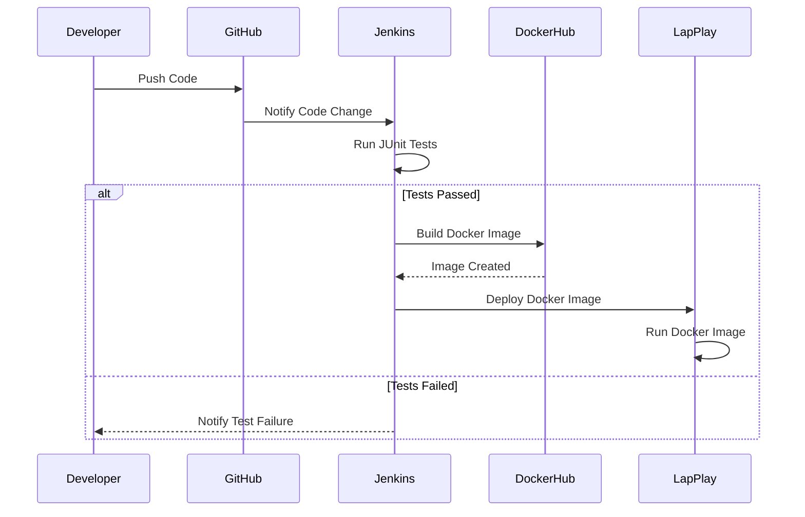

https://labs.iximiuz.com/playgrounds/docker/696a2367bfdabbdd890dc74a

# Before Docker: 
The relationship between developers and testers was often strained due to environment inconsistencies. Developers would say, "It works on my machine," while testers struggled with bugs caused by differences in local setups. Setting up environments manually was time-consuming and prone to errors, leading to frustration on both sides.


# After Docker: 
Docker improved the relationship between developers and testers by allowing them to work in identical, containerized environments. Testers could now run the same environment as developers, reducing "works on my machine" issues. This consistency streamlined testing, improved collaboration, and minimized environment-related conflicts.


# A short process for creating a Docker image and deploying it in IntelliJ:

1. Install Docker Plugin in IntelliJ:
Go to File > Settings > Plugins and search for the Docker plugin. Install it and restart IntelliJ.
2. Create a Dockerfile:
In your project root, right-click and select New > File, name it Dockerfile.
Write your Docker instructions. Example for a Java app
```java
FROM maven:3.9.6-eclipse-temurin-17
WORKDIR /app
COPY pom.xml .
COPY . /app
RUN mvn package
CMD ["java", "-jar", "target/YOURJAR.jar"]
```
3. Build the Docker Image:
Open the terminal in IntelliJ and run

```cmd
docker build -t your-app-name .

```
- This creates a Docker image based on the Dockerfile.

4. Run the Docker Container:
After building the image, deploy the container:
```cmd
docker run -p 8080:8080 your-app-name

```
- This starts the container and exposes it on port 8080.

5. Run and Test:
The app is now running inside a Docker container. You can access it from localhost:8080 in your browser or via API tools like Postman.
In IntelliJ, Docker integration allows you to manage containers, view logs, and monitor the deployment process all within the IDE.


## Example
```css
src
 ├── main
 │   └── java
 │       └── Calculator.java
 └── test
     └── java
         └── TestTest.java


```

## **Important Note** 
- this is a sample pom and you have to customize based on your own calss name **<mainClass>** *"YOUR OWN Main Class"*  and also change the *<finalname>* modify it for your jar filename <finalnam>

```xml
 <build>
        <finalName>tripcalaculator</finalName>
        <plugins>
            <!-- Compiler Plugin for setting the Java version -->
            <plugin>
                <groupId>org.apache.maven.plugins</groupId>
                <artifactId>maven-compiler-plugin</artifactId>
                <version>3.13.0</version>
                <configuration>
                    <source>21</source>
                    <target>21</target>
                </configuration>
            </plugin>

            <!-- JAR Plugin for configuring the manifest file -->
            <plugin>
                <groupId>org.apache.maven.plugins</groupId>
                <artifactId>maven-jar-plugin</artifactId>
                <version>3.4.2</version>
                <configuration>
                    <archive>
                        <manifest>
                            <mainClass>TripCostCalculator</mainClass> <!-- Correct main class -->
                        </manifest>
                    </archive>
                </configuration>
            </plugin>


            <!-- Other plugins like compiler, jar, jacoco... -->

            <!-- Surefire Plugin for running tests -->
            <plugin>
                <groupId>org.apache.maven.plugins</groupId>
                <artifactId>maven-surefire-plugin</artifactId>
                <version>3.2.5</version> <!-- Latest stable version -->
                <configuration>
                    <includes>
                        <include>**/Test*.java</include>
                        <include>**/*Test.java</include>
                        <include>**/*Tests.java</include>
                    </includes>
                </configuration>
            </plugin>


            <!-- JaCoCo Plugin for code coverage -->
            <plugin>
                <groupId>org.jacoco</groupId>
                <artifactId>jacoco-maven-plugin</artifactId>
                <version>0.8.12</version>
                <executions>
                    <execution>
                        <id>jacoco-initialize</id>
                        <goals>
                            <goal>prepare-agent</goal>
                        </goals>
                    </execution>
                    <execution>
                        <id>jacoco-report</id>
                        <phase>test</phase>
                        <goals>
                            <goal>report</goal>
                        </goals>
                    </execution>
                </executions>
            </plugin>
        </plugins>
    </build>

    <dependencies>
        <!-- JUnit for testing -->
        <dependency>
            <groupId>junit</groupId>
            <artifactId>junit</artifactId>
            <version>4.13.2</version>
            <scope>test</scope>
        </dependency>
        <dependency>
            <groupId>org.junit.jupiter</groupId>
            <artifactId>junit-jupiter</artifactId>
            <version>5.11.1</version>
            <scope>compile</scope>
        </dependency>

    </dependencies>
```


```java
import java.util.Scanner;

public class Calculator {
    // Constructor
    Calculator() {}

    public static void main(String[] args) {
        Calculator test = new Calculator();  // Create an instance of Test
        test.run();              // Call the run method
    }

    // Method to handle input and perform addition
    public void run() {
        Scanner sc = new Scanner(System.in);

        System.out.println("Enter the first number ");
        int num1 = sc.nextInt();

        System.out.println("Enter the second number");
        int num2 = sc.nextInt();

        int sum = addNumbers(num1, num2);
        System.out.println("Here is the sum: " + sum);
    }

    // Non-static method to add numbers
    public int addNumbers(int num1, int num2) {
        return num1 + num2;
    }
}

```
```Java
import static org.junit.jupiter.api.Assertions.assertEquals;
import org.junit.jupiter.api.Test;

public class CalculatorTest {

    Calculator testInstance = new Calculator();

    @Test
    public void testAddition() {
        // Test case 1: Positive numbers
        int num1 = 5;
        int num2 = 10;
        int expectedSum = 15;

        int actualSum = testInstance.addNumbers(num1, num2);
        assertEquals(expectedSum, actualSum);

        // Test case 2: Negative numbers
        num1 = -5;
        num2 = -10;
        expectedSum = -15;

        actualSum = testInstance.addNumbers(num1, num2);
        assertEquals(expectedSum, actualSum);

        // Test case 3: Mixed numbers
        num1 = -5;
        num2 = 10;
        expectedSum = 5;

        actualSum = testInstance.addNumbers(num1, num2);
        assertEquals(expectedSum, actualSum);
    }

    @Test
    public void testEdgeCases() {
        // Test zero case
        assertEquals(0, testInstance.addNumbers(0, 0));

        // Test large numbers
        assertEquals(Integer.MAX_VALUE, testInstance.addNumbers(Integer.MAX_VALUE, 0));

        // Test minimum integer
        assertEquals(Integer.MIN_VALUE, testInstance.addNumbers(Integer.MIN_VALUE, 0));
    }
}


```

```docker
# Use Maven image to build the application
FROM maven:latest

# Set working directory inside the container
WORKDIR /app

# Copy the pom.xml to download dependencies first (caching optimization)
COPY pom.xml /app/

# Copy the entire project to the container
COPY . /app/

# Package the application using Maven
RUN mvn package

# Run the main class from the built JAR
CMD ["java", "-jar", "target/Test.jar"]


```
```groovy
pipeline {
    agent any

    environment {
        PATH = "C:\\Program Files\\Docker\\Docker\\resources\\bin;${env.PATH}"
        
        // Define Docker Hub credentials ID
        DOCKERHUB_CREDENTIALS_ID = 'Docker_Hub'
        // Define Docker Hub repository name
        DOCKERHUB_REPO = 'amirdirin/week6_inclass_test1'
        // Define Docker image tag
        DOCKER_IMAGE_TAG = 'latest'
    }
    
    tools {
        maven 'Maven3'
    }

    stages {
        stage('Check Docker') {
            steps {
                bat 'docker --version'
            }
        }

        stage('Checkout') {
            steps {
                git branch: 'master', url: 'https://github.com/ADirin/week6_lecturedemo_SEP-.git' //CHECK THE GITHUB REPO
            }
        }

        stage('Build') {
            steps {
                bat 'mvn clean install'
            }
        }

        stage('Test') {
            steps {
                bat 'mvn test'
            }
        }

        stage('Code Coverage') {
            steps {
                bat 'mvn jacoco:report'
            }
        }

        stage('Publish Test Results') {
            steps {
                junit '**/target/surefire-reports/*.xml'
            }
        }

        stage('Publish Coverage Report') {
            steps {
                jacoco()
            }
        }

        stage('Build Docker Image') {
            steps {
                bat 'docker build -t %DOCKERHUB_REPO%:%DOCKER_IMAGE_TAG% .'
            }
        }

        stage('Push Docker Image to Docker Hub') {
            steps {
                withCredentials([usernamePassword(credentialsId: "${DOCKERHUB_CREDENTIALS_ID}", usernameVariable: 'DOCKER_USER', passwordVariable: 'DOCKER_PASS')]) {
                    bat '''
                        docker login -u %DOCKER_USER% -p %DOCKER_PASS%
                        docker push %DOCKERHUB_REPO%:%DOCKER_IMAGE_TAG%
                    '''
                }
            }
        }
    }
}

```
## Build the file in the docker consol

```cmd
docker build -t your-app-name .

```
Use the `-it` flag with docker run to run the container in interactive mode, allowing your program to wait for and accept input from the console.
```cmd
docker run -it your-app-name
```
For desktop docker use the command line for the execution


 From GitHub to Docker Hub through Jenkins

> 

Jacoco report

> 


Running the Image remotely from Hub.docker.com:

> 


Run the Images from HUB remotely

 1. open the following link [Play docker](https://labs.play-with-docker.com/)
 2. puul the image you want to test from hub.docker.com (your image repo) with the following command:
    - docker pull yourusername/imagename:ver
    - for example:
    ```cmd
   
    docker pull amirdi/devopschain:ver2
    ```
 3.  get the list of the images pulled from the docker hub
    ```cmd
       docker images
    ```
 4. run the image
 - docker run -it imageid
 - for example:
   ```cmd
    docker run -it  4cb87ade08
   ```


 

# Summery of the process

1. Developer pushes code to GitHub.
2. GitHub notifies Jenkins about the code change.
3. Jenkins runs JUnit tests.
4. If the tests pass:
    - Jenkins builds a Docker image and pushes it to DockerHub.
    - Jenkins then instructs LapPlay to deploy the Docker image.
    - LapPlay runs the Docker image.
5. If the tests fail, Jenkins notifies the Developer about the test failure.




