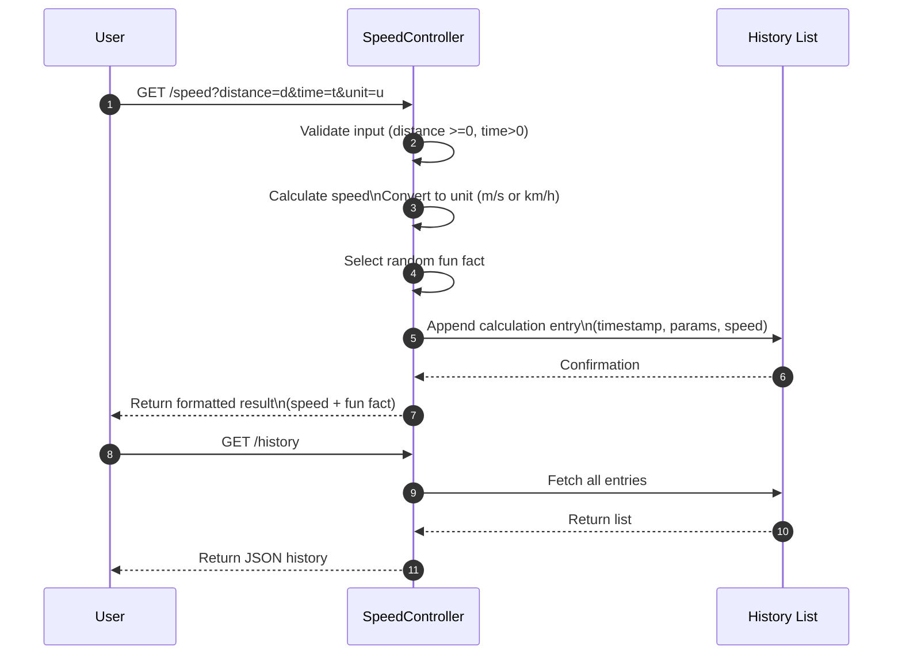

github repo of the [following example in windows environment] https://github.com/ADirin/week8_minikube_example.git 

# Introduction to Kubernetes 

Kubernetes (often abbreviated as K8s) is an open-source platform used to automate the deployment, scaling, and management of containerized applications. It helps run applications packaged in containers (such as those created with Docker) across a cluster of machines in a reliable and efficient way. In simple terms, Kubernetes acts as a container orchestrator. It manages where containers run, keeps them running, and automatically handles tasks such as restarting failed containers, balancing traffic, and scaling applications when demand increases.

**Key functions of Kubernetes**

- Container orchestration – manages multiple containers across servers
- Automatic scaling – increases or decreases the number of running containers based on demand
- Self-healing – restarts containers if they crash
- Load balancing – distributes traffic between containers
- Rolling updates – updates applications without downtime

Kubernetes was originally developed by Google and is now maintained by the Cloud Native Computing Foundation.
In modern cloud-native development, Kubernetes is commonly used together with container technologies like Docker to deploy and manage microservices and distributed applications.

## Project Description

The Speed API project (The lecture demo during the course) is a simple Java-based RESTful web service built with Spring Boot. The purpose of this project is to demonstrate modern containerized application development and deployment using Docker and Kubernetes. 
The application exposes a basic API endpoint implemented in the SpeedController, allowing users to interact with the service through HTTP requests. The project includes a Dockerfile to containerize the Spring Boot application, enabling it to run consistently across different environments. 
In addition, the deployment.yaml file provides a Kubernetes deployment configuration, showing how the containerized application can be deployed, managed, and scaled within a Kubernetes cluster.
Overall, this project serves as a practical example of:
- Building a Spring Boot REST API
- Packaging applications with Docker containers
- Deploying and orchestrating services using Kubernetes


The diagram illustrates the **end-to-end deployment and interaction flow** of the **Speed API**.

## Sequence of Steps

1. **Developer builds the application**  
   - Action: Using the `Dockerfile` to create a container-ready application.  
   - Tag: `<Developer>`

2. **Docker builds the container image and pushes it**  
   - Action: Image is pushed to **Docker Hub** for storage and later use.  
   - Tag: `<Docker>` `<DockerHub>`

3. **Kubernetes deploys the application**  
   - Action: Kubernetes pulls the container image from Docker Hub and deploys it using `deployment.yaml`.  
   - Tag: `<KubernetesCluster>` `<DockerHub>`
  
     ```xml
      PS C:\> docker tag speed-api:1.0 amirdirin/speed-api:1.0
      PS C:\> docker images
                                                                                                 i Info →   U  In Use
      IMAGE                                                          ID             DISK USAGE   CONTENT SIZE   EXTRA
      amirdi/speed-api:1.0                                           35e8bdb76e4b        206MB             0B

     ```

4. **Service starts in Kubernetes**  
   - Action: The Speed API service starts running in the cluster and becomes available for requests.  
   - Tag: `<KubernetesCluster>` `<SpeedAPI>`

     ```xml
      PS C:\\...\Documents\Winter2026\LectDemo\week8\lecttest\FInalCheck> kubectl get svc                 
      NAME                 TYPE        CLUSTER-IP      EXTERNAL-IP   PORT(S)          AGE
      calculator-service   NodePort    10.107.209.82   <none>        80:30007/TCP     3d11h
      kubernetes           ClusterIP   10.96.0.1       <none>        443/TCP          3d11h
      mariadb-service      ClusterIP   10.104.6.153    <none>        3306/TCP         14h
       **speed-api-service    NodePort    10.102.27.209   <none>        9090:30080/TCP   15s**

    ```

      ```xml
      c:\....\Documents\Winter2026\LectDemo\week8\lecttest\FInalCheck> kubectl get pods -w
      speed-app-8fbc86cfc-q2g78                1/1     Running             137 (5m10s ago)   13h
      speed-gui-d898489f6-xj699                1/1     Running             134 (5m5s ago)    14h
      
      ```


5. **User sends a request**  
   - Action: A user interacts with the API by sending an HTTP request to the Kubernetes service endpoint.  
   - Tag: `<User>` `<SpeedAPI>`
  
   ```xml
    http://localhost:9090/speed?distance=100&time=2

   ```

7. **API responds with data**  
   - Action: The Speed API processes the request and returns the response to the user.  
   - Tag: `<SpeedAPI>` `<User>`
It is intended for learning and demonstration purposes, illustrating a basic workflow for developing, containerizing, and deploying cloud-native applications.
Create new project similar as the figure below:

```
speed-api/
├─ pom.xml
├─ Dockerfile
├─ deployment.yaml
├─ src/
│  └─ main/
│     ├─ java/
│     │  └─ com/
│     │     └─ example/
│     │        └─ speedapi/
│     │           ├─ SpeedApiApplication.java
│     │           └─ SpeedController.java
│     └─ resources/
│        └─ application.properties
└─ README.md
```
Why we do in this project demonstrated in the following sequence diagram




---

# 📄 `pom.xml`

```xml
<?xml version="1.0" encoding="UTF-8"?>
<project xmlns="http://maven.apache.org/POM/4.0.0"
         xmlns:xsi="http://www.w3.org/2001/XMLSchema-instance"
         xsi:schemaLocation="http://maven.apache.org/POM/4.0.0 http://maven.apache.org/xsd/maven-4.0.0.xsd">
    <modelVersion>4.0.0</modelVersion>

    <groupId>com.example</groupId>
    <artifactId>speed-api</artifactId>
    <version>1.0.0</version>
    <name>speed-api</name>
    <description>Simple REST API to calculate speed = distance / time</description>

    <properties>
        <java.version>17</java.version>
        <spring.boot.version>3.2.0</spring.boot.version>
    </properties>

    <parent>
        <groupId>org.springframework.boot</groupId>
        <artifactId>spring-boot-starter-parent</artifactId>
        <version>${spring.boot.version}</version>
    </parent>

    <dependencies>
        <dependency>
            <groupId>org.springframework.boot</groupId>
            <artifactId>spring-boot-starter-web</artifactId>
        </dependency>

        <dependency>
            <groupId>org.springframework.boot</groupId>
            <artifactId>spring-boot-starter-validation</artifactId>
        </dependency>

        <dependency>
            <groupId>org.springframework.boot</groupId>
            <artifactId>spring-boot-starter-test</artifactId>
            <scope>test</scope>
        </dependency>
    </dependencies>

    <build>
        <plugins>
            <plugin>
                <groupId>org.springframework.boot</groupId>
                <artifactId>spring-boot-maven-plugin</artifactId>
            </plugin>
        </plugins>
    </build>
</project>
```

## Short description on new tags:
 - Properties
```xml

<properties>
    <java.version>17</java.version>
    <spring.boot.version>3.2.0</spring
```
java.version (17)
- Spring Boot 3.x requires Java 17+. Setting this ensures your code compiles and runs with the right language level and APIs (records, sealed classes, pattern matching improvements, etc.).
- spring.boot.version (3.2.0)
Centralizes your Spring Boot version. You reference it in parent and can bump it in one place later.

  - Parent (BOM / dependency management)

 ```XML
<parent>
    <groupId>org.springframework.boot</groupId>
    <artifactId>spring-boot-starter-parent</artifactId>
    <version>${spring.boot.version}</version>
</parent>
```
The Spring Boot Starter Parent acts like a Bill of Materials (BOM) and provides:

Managed, compatible versions of Spring and third‑party libraries (so you usually don’t specify versions for starters).
Sensible plugin defaults and reproducible build settings.
Standard Maven configuration (encoding, resource filtering, plugin versions).

Why: It dramatically reduces boilerplate and prevents version conflicts.

 - Dependencies
   1) Web stack
```xml
<dependency>
    <groupId>org.springframework.boot</groupId>
    <artifactId>spring-boot-starter-web</artifactId>
</dependency>

```
What it brings (transitively):
Spring MVC for building REST endpoints (@RestController, @GetMapping, @PostMapping, etc.).
Jackson for JSON serialization/deserialization (turning request/response bodies into Java objects and back).
Embedded Tomcat as the default HTTP server (so you can run a fat JAR with java -jar and get an HTTP server without installing anything).
Why: Your service exposes a REST API to compute speed; this starter gives you the MVC framework, JSON, and an embedded server out of the box.

  2) Bean validation (Jakarta Validation)
```xml
<dependency>
    <groupId>org.springframework.boot</groupId>
    <artifactId>spring-boot-starter-validation</artifactId>
</dependency>

```
What it brings:
Jakarta Bean Validation implementation (Hibernate Validator) and APIs.
Integration with Spring MVC so your request DTOs annotated with constraints are automatically validated.
Why: Your endpoint likely receives input like { "distance": 42.0, "time": 0.0 }.
Validation lets you fail fast with meaningful errors:

---
  3) Test stack
```xml
<dependency>
    <groupId>org.springframework.boot</groupId>
    <artifactId>spring-boot-starter-test</artifactId>
    <scope>test</scope>
</dependency>

```
What it brings:

JUnit Jupiter (JUnit 5) for writing tests.
Spring Test for bootstrapping the Spring context in tests (@SpringBootTest, @WebMvcTest, etc.).
MockMvc for testing MVC controllers without running the server.
AssertJ, Hamcrest, Mockito, and JSON test helpers.

   - Build plugins

```xml
<build>
    <plugins>
        <plugin>
            <groupId>org.springframework.boot</groupId>
            <artifactId>spring-boot-maven-plugin</artifactId>
        </plugin>
    </plugins>
</build>

```
Spring Boot Maven Plugin:
Repackages the app into an executable fat JAR with all dependencies (spring-boot:repackage), so you can run:
for example to:
```xml
mvn clean package
java -jar target/speed-api-1.0.0.jar
```
         - Adds a proper main class manifest entry automatically.
         - Supports build-time layered jars for Docker efficiency (faster rebuilds).
         - Integrates with Spring Boot’s run goal for hot reload during development:
```xml

mvn spring-boot:run

```


# 📄 `src/main/java/com/example/speedapi/SpeedApiApplication.java`


```java
package com.example.speedapi;

import org.springframework.boot.SpringApplication;
import org.springframework.boot.autoconfigure.SpringBootApplication;

@SpringBootApplication
public class SpeedApiApplication {

    public static void main(String[] args) {
        SpringApplication.run(SpeedApiApplication.class, args);
    }
}
```
- SpeedApiApplication is the entry point of your Spring Boot application.
- It’s the class whose main method gets executed when you run the JAR (e.g., java -jar speed-api-1.0.0.jar) or when you run the app from your IDE.


---

# 📄 `src/main/java/com/example/speedapi/SpeedController.java`

```java
package com.example.speedapi;

import org.springframework.web.bind.annotation.GetMapping;
import org.springframework.web.bind.annotation.RequestParam;
import org.springframework.web.bind.annotation.RestController;

@RestController
public class SpeedController {

    @GetMapping("/speed")
    public double calculateSpeed(@RequestParam double distance, @RequestParam double time) {
        if (time == 0) {
            throw new IllegalArgumentException("Time cannot be zero");
        }
        return distance / time;
    }
}
```
### What this class is
  - SpeedController is a Spring REST controller that exposes an HTTP endpoint to compute speed from query parameters.
  - It is stateless (no fields), so it’s thread-safe under typical Spring usage and can be a singleton bean.
---

# 📄 `src/main/resources/application.properties`

```properties
# Uncomment to change the port:
# server.port=9090
```
server.port=9090

 - This property tells Spring Boot which port the embedded web server should listen on.
 - By default, Spring Boot starts on port 8080.

---

# 📄 `Dockerfile`

```dockerfile
FROM eclipse-temurin:17-jdk-alpine AS build
WORKDIR /src
COPY . .
RUN ./mvnw -q -DskipTests package || mvn -q -DskipTests package

FROM eclipse-temurin:17-jre-alpine
WORKDIR /app
COPY target/speed-api-1.0.0.jar app.jar

EXPOSE 8080
ENTRYPOINT ["java", "-jar", "app.jar"]
```
This is a multi-stage Docker build:

 - Stage 1 (build): Uses a full JDK and Maven to compile and package the app into a runnable JAR.
 - Stage 2 (runtime): Uses a slimmer JRE-only image to run the already-built JAR.


Why: Keeps the final image small and secure (no compilers, no Maven, fewer tools). You ship only what’s needed to run.
---

# 📄 `deployment.yaml`

```yaml
apiVersion: apps/v1
kind: Deployment
metadata:
  name: speed-api
spec:
  replicas: 1
  selector:
    matchLabels:
      app: speed-api
  template:
    metadata:
      labels:
        app: speed-api
    spec:
      containers:
        - name: speed-api
          image: speed-api:1.0
          imagePullPolicy: Never
          ports:
            - containerPort: 8080
---
apiVersion: v1
kind: Service
metadata:
  name: speed-api-service
spec:
  type: NodePort
  selector:
    app: speed-api
  ports:
    - name: http
      port: 9090
      targetPort: 9090
      nodePort: 30080
```
It defines two resources separated by ---:

A Deployment named speed-api (manages Pods and rolling updates).
A Service named speed-api-service of type NodePort (exposes the Pod on a stable port from the node).


## How to run the application


# 📄 `README.md`

**Note** Make sure your docker and the minikube is running (first run the docker desktop and then minikube start)

```markdown
# Speed API

A minimal Spring Boot REST API that calculates speed = distance / time.

## Endpoints

- `GET /speed?distance=100&time=2` → `50.0`

## Build & Run (Local)

```bash
mvn clean package
java -jar target/speed-api-1.0.0.jar

mvn spring-boot:run

```

Open:  
http://localhost:9090/speed?distance=100&time=2

---------------------------------------------------------------------------------------

🎉 "**_Improved version of the example_**" https://github.com/ADirin/kubernetes_selfstudy_improved.git

---------------------------------------------------------------------------------------


## Most usefull comments for docker and kubernetes
### To Change port:
Edit `src/main/resources/application.properties`:

```
server.port=9090
```

---

# Docker

```bash
mvn clean package
docker build -t speed-api:1.0 .
docker run -p 8080:8080 speed-api:1.0
```

---

# Minikube (Windows)

```bash
minikube start
minikube image load speed-api:1.0
kubectl apply -f deployment.yaml
kubectl get pods
kubectl get svc speed-api-service
```

Open in browser:

```
http://$(minikube ip):30080/speed?distance=150&time=3
```

---

# Notes

- If port 9090 is busy, kill the process:
  ```powershell
  netstat -ano | findstr :8080
  taskkill /PID <pid> /F /T
  ```

---

# Quick Commands

To run the minikube:
Minikube:
```powershell
minikube start
minikube image load speed-api:1.0
kubectl apply -f deployment.yaml
kubectl get pods
kubectl get svc speed-api-service
```


Build jar:
```powershell
mvn clean package
```

Run locally:
```powershell
mvn spring-boot:run
java -jar target/speed-api-1.0.0.jar
```

Docker:
```powershell
docker build -t speed-api:1.0 .
docker run -p 9090:9090 speed-api:1.0
```


Finally in your browser run
```html
http://localhost:9090/speed?distance=100&time=2

```

9090 version:
```
http://<minikube-ip>:30090/speed?distance=120&time=3

````
## If the port busy

```# Fixing Port Conflicts on Windows

If your application or Docker container cannot start because the port is already in use, follow these steps.

---

## 1️⃣ Find which process is using the port

Open PowerShell and run:

```powershell
netstat -ano | findstr :9090

```
Output example
TCP    0.0.0.0:9090    0.0.0.0:0    LISTENING    12345

2️⃣ Kill the process
Terminate the process holding the por
````
taskkill /PID 12345 /F
````
3️⃣ (Optional) Change your application's port

In Spring Boot, you can run on a different port without killing processes:

Command line:
```
mvn spring-boot:run -Dserver.port=9091
```
Or in application.properties:

```
server.port=9091
```
4️⃣ (Optional) Check Docker containers

Docker containers can also block ports. List all running containers:

```
docker ps
```
Stop/remove any container using the conflicting port:

```
docker stop <container_id>
docker rm <container_id>

```
Tip: Always verify the port is free before starting your app:

```
netstat -ano | findstr :9090

```
